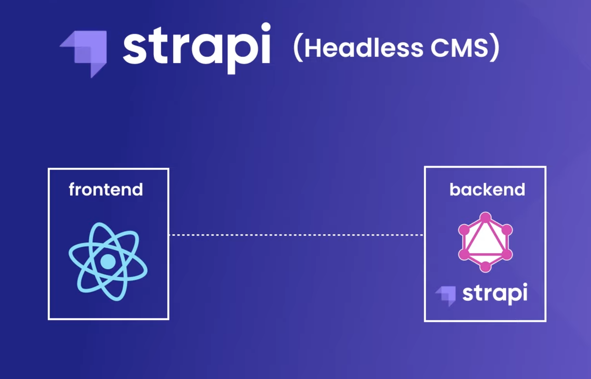

# Strapi Crash Course

## 📖 Chapters

1. Intro & Setup
1. Create a Strapi App
1. Content Types & Endpoints
1. Permissions & Auth Requests
1. Creating a React App
1. Fetching Strapi Data
1. Fetching a Single Record
1. GraphQL Plugin & Overview
1. Apollo Client Setup
1. The useQuery Hook
1. Query Variables
1. Relational Data
1. Fetching Related Data
1. Rich Text Content
